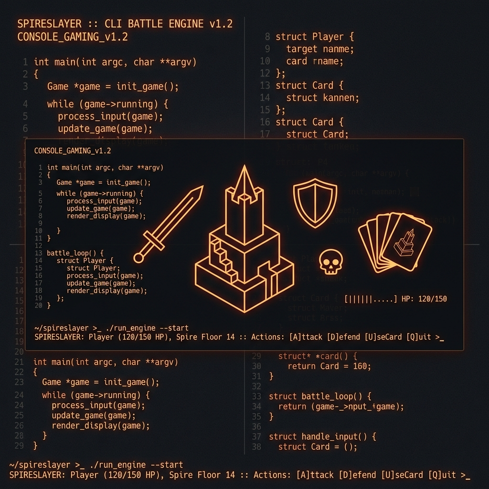

# Spireslayer: Command-Line Interpreter 🗡️🃏



## 📋 Table of Contents
- [Overview](#overview)
- [System Architecture](#system-architecture)
- [Key Components](#key-components)
- [Installation](#installation)
- [Usage](#usage)
- [Testing & Validation](#testing--validation)
- [License](#license)

---

## 🔍 Overview
**Spireslayer** is a high-performance command-line interpreter (REPL) developed in **C** for a systems programming course at **Boğaziçi University**. Inspired by the mechanics of *Slay the Spire*, it features an autonomous backtracking lexical parser and robust state management routines to simulate a dynamic game environment through a terminal interface.

## 🏗️ System Architecture
The system is engineered for **memory safety**, **syntactic precision**, and **modular scalability**:
- **Lexical Parser**: An iterative backtracking engine that enforces strict identifiers and pseudo-English grammatical rules.
- **Backing Store**: Amortized doubling algorithms provide secure, unbounded inventory and state management.
- **State Engine**: A decoupled logic layer monitors progression, currencies, and item invariants without leaking implementation details.

## ✨ Key Components
- **Dynamic Inventory**: Monitors Relics, Cards, and Currencies with $O(1)$ access and $O(n)$ amortized scaling.
- **Command Sanitization**: Rigorous CRLF and whitespace handling to ensure buffer integrity against pipe redirections.
- **Memory Management**: Zero-leak policy ensured via granular cleanup routines across all execution branches.

## 🚀 Installation
1. Ensure you have `gcc` and `make` installed.
2. Clone the repository:
   ```bash
   git clone https://github.com/yigitsarpavci/Spireslayer-Command-Interpreter.git
   ```
3. Navigate to the project directory:
   ```bash
   cd Spireslayer-Command-Interpreter
   ```

## 💻 Usage
Build the project using the optimized Makefile:
```bash
make
```
Launch the interpreter:
```bash
./spireslayer
```

## 🧪 Testing & Validation
The project includes a comprehensive verification suite:
- **Automated Tests**: Located in the `tests/` directory, covering syntactic edge cases and semantic invariants.
- **Technical Report**: A deep dive into the implementation details is available in `docs/report.pdf`.

## 📄 License
This project is licensed under the **MIT License**. See the [LICENSE](LICENSE) file for details.

---
### 🔗 The Algorithmic Excellence Series
*Looking for more high-performance implementations?*
- **[MatrixNet](https://github.com/yigitsarpavci/MatrixNet-The-Operator-s-Console)**: Graph Theory & SCC Analysis.
- **[GigMatch-Pro](https://github.com/yigitsarpavci/GigMatch-Pro)**: Priority Queue Matching Algorithms.
- **[Nightpass](https://github.com/yigitsarpavci/Nightpass-A-Survival-Card-Game)**: State-Machine Survival Mechanics.

---
*Developed with ❤️ by Yiğit Sarp Avcı*
